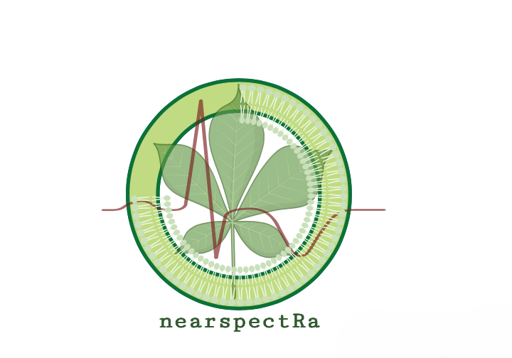

# nearspectRa


<!-- badges: start -->
[](https://github.com/georgejr45/project-X/actions/workflows/R-CMD-check.yaml)
<!-- badges: end -->

The goal of nearspectRa is to import, process and plot NIRS data ( Package is not ready yet ).

## Installation

This package is expected to publish by early 2025:

``` r
remotes::install_github("georgejr45/nearspectRa")
```

## Example

This is a basic example which shows you how to solve a common problem:

``` r
library(nearspectRa)
## basic example code
```

